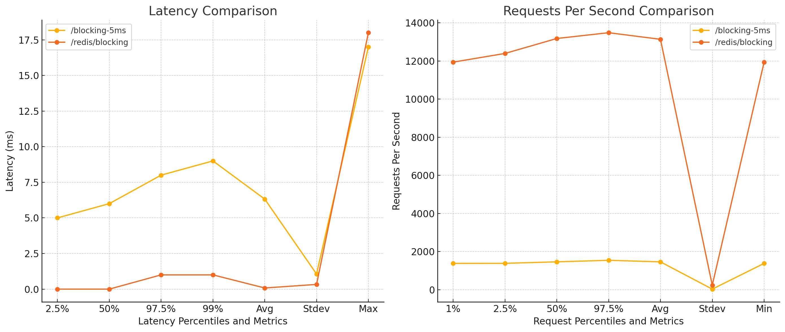

### Analysis of `autocannon` Benchmark Data

Let's break down the performance of the two tests:

#### 1. **Latency Analysis**
- **/blocking-5ms:**
  - **Avg Latency:** 6.32 ms
  - **50th Percentile (Median):** 6 ms
  - **97.5th Percentile:** 8 ms
  - **Max Latency:** 17 ms

- **/redis/blocking:**
  - **Avg Latency:** 0.08 ms
  - **50th Percentile (Median):** 0 ms
  - **97.5th Percentile:** 1 ms
  - **Max Latency:** 18 ms

**Comparison:**
- The Redis-backed service (`/redis/blocking`) shows significantly lower average latency, with most requests completing in under 1 ms.

#### 2. **Request Rate Analysis**
- **/blocking-5ms:**
  - **Avg Requests/Sec:** 1,463.9
  - **50th Percentile:** 1,465 Req/Sec
  - **97.5th Percentile:** 1,545 Req/Sec

- **/redis/blocking:**
  - **Avg Requests/Sec:** 13,140.8
  - **50th Percentile:** 13,183 Req/Sec
  - **97.5th Percentile:** 13,487 Req/Sec

**Comparison:**
- The Redis-backed service handles significantly more requests per second, approximately 9 times more than the non-Redis service.

#### 3. **Data Transfer Rate**
- **/blocking-5ms:**
  - **Avg Data Transfer:** 350 kB/s
  - **Total Data Read:** 21 MB

- **/redis/blocking:**
  - **Avg Data Transfer:** 3.14 MB/s
  - **Total Data Read:** 188 MB

**Comparison:**
- The Redis-backed service transfers data at a much higher rate, consistent with its higher request rate.

### Table Summary

| Metric                          | /blocking-5ms            | /redis/blocking            |
|---------------------------------|--------------------------|----------------------------|
| **Avg Latency**                 | 6.32 ms                  | 0.08 ms                    |
| **50th Percentile Latency**     | 6 ms                     | 0 ms                       |
| **97.5th Percentile Latency**   | 8 ms                     | 1 ms                       |
| **Max Latency**                 | 17 ms                    | 18 ms                      |
| **Avg Requests/Sec**            | 1,463.9                  | 13,140.8                   |
| **50th Percentile Requests/Sec**| 1,465                    | 13,183                     |
| **97.5th Percentile Requests/Sec**| 1,545                  | 13,487                     |
| **Avg Data Transfer**           | 350 kB/s                 | 3.14 MB/s                  |
| **Total Requests**              | 88k                      | 788k                       |
| **Total Data Read**             | 21 MB                    | 188 MB                     |

### Charts

Let's plot these metrics to visualize the comparison.

Here are the charts comparing the performance of the `/blocking-5ms` and `/redis/blocking` endpoints:

1. **Latency Comparison**: The Redis-backed service (`/redis/blocking`) consistently shows lower latency across all metrics, with most requests being processed almost instantaneously.

2. **Requests Per Second Comparison**: The Redis-backed service handles a significantly higher number of requests per second, demonstrating much better throughput than the non-Redis service.

These charts visually represent the performance differences, highlighting the efficiency gains from using Redis for handling requests.

Here are the tables analyzing the latency and requests per second data for the three scenarios: `Blocking-5ms`, `Blocking-25ms`, and `Redis`.

### Latency Table (in milliseconds)
| Percentile/Metric | Blocking-5ms Latency (ms) | Blocking-25ms Latency (ms) | Redis Latency (ms) |
|-------------------|--------------------------|----------------------------|--------------------|
| 2.5%              | 5.00                      | 26.00                      | 0.00               |
| 50%               | 6.00                      | 28.00                      | 0.00               |
| 97.5%             | 8.00                      | 30.00                      | 1.00               |
| 99%               | 9.00                      | 30.00                      | 1.00               |
| Avg               | 6.32                      | 27.91                      | 0.08               |
| Stdev             | 1.06                      | 1.02                       | 0.33               |
| Max               | 17.00                     | 36.00                      | 18.00              |

### Requests per Second Table
| Percentile/Metric | Blocking-5ms Req/Sec | Blocking-25ms Req/Sec | Redis Req/Sec |
|-------------------|----------------------|-----------------------|---------------|
| 1%                | 1383.00              | 340.00                | 11943.00      |
| 2.5%              | 1386.00              | 341.00                | 12399.00      |
| 50%               | 1465.00              | 350.00                | 13183.00      |
| 97.5%             | 1545.00              | 362.00                | 13487.00      |
| Avg               | 1463.90              | 352.40                | 13140.80      |
| Stdev             | 33.09                | 5.59                  | 240.44        |
| Min               | 1383.00              | 340.00                | 11939.00      |

Blocking requests are decreasing req/sec better to use non-blocking request via interceptor.